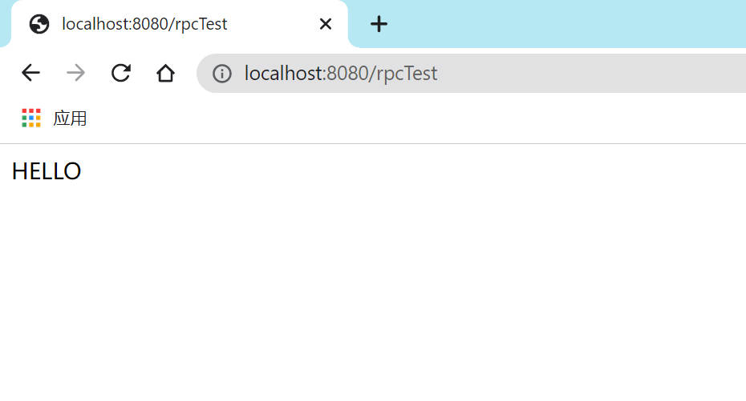

# RPC-framework

#### Description
A simple, lightweight, Java based remote method invoke framework.


#### Software Architecture
Software architecture description

#### Installation


1. rpc Server side: add this maven dependency
    ```xml
       <dependencies>
            <dependency>
                <groupId>org.noexcs</groupId>
                <artifactId>rpc-provider-server</artifactId>
                <version>1.0-SNAPSHOT</version>
            </dependency>
        </dependencies>
    ```
   Add Server side configuration file：`rpc-provider-config.yaml`
    ```yaml
    # Server side IP and Port
    server:
      host: "localhost"
      port: 8007
    
   # Register center address.
   # It will register service to the register center if enabled.
    registry:
      enabled: false
      server: 127.0.0.1
      port: 8848
      # service name
      serviceName: rpc-public
    ```
2. rpc client side add this maven dependency
   ```xml
       <dependencies>
            <dependency>
                <groupId>org.noexcs</groupId>
                <artifactId>rpc-consumer-client</artifactId>
                <version>1.0-SNAPSHOT</version>
            </dependency>
        </dependencies>
   ```
   Add client side configuration file：`rpc-consumer-config.yml`
    ```yaml
    # Connect to the server directly
    # rpc server address
    provider:
      server: 127.0.0.1
      port: 8007
   
   # register center address
   # It will discover service from register center if enabled
    registry:
      enabled: false
      type: nacos # register center type, only support nacos temporarily
      serviceName: rpc-public  # service name
      server: 127.0.0.1
      port: 8848
      # load balance strategy: must extend org.noexcs.loadBalance.AbstractLoadBalance
      loadBalancer: org.noexcs.loadBalance.impl.RandomBalance
    ```


#### Instructions

1. Server side

   Define rpc service using class, and annotated with `@Service`
    ```java
   import org.springframework.stereotype.Service;
   
    @Service
    public class StringUppercaseService {
   
        String upperCaseString(String s){
            return s.toUpperCase();
        }
   
    }
    ```
   Start Server：
   ```java
   public class ServerMain {
       public static void main(String[] args) {
            RpcServer.startBackground(ServerMain.class, true);
            new CountDownLatch(1).await();
       }
   }
   ```
2. Client side

   Write service interface correspondingly
    ```java
    public interface StringUppercaseService {
    
        String upperCaseString(String s);
   
    }
    ```
   > interface's full qualified name must as same as Server side's service class
   > and the method you invoke should also have a same name and parameter list

   invoke service：
   ```java
   public class ConsumerMain {
       public static void main(String[] args) {
           StringUpperCaseService upperCaseService = new RpcClientProxy().getProxy(StringUpperCaseService.class);
           String s = upperCaseService.upperCaseString("Hello World!");
           System.out.println(s);
       }
   }
   ```


#### Client integrates with Spring Boot
1. Import following maven dependency：
   ```xml
       <dependencies>
           <dependency>
               <groupId>org.noexcs</groupId>
               <artifactId>rpc-noexcs-spring-boot-starter</artifactId>
               <version>1.0</version>
           </dependency>
           <!-- Spring 相关依赖 -->
       </dependencies>
   ```

2. Configure some rpc server info in application.yml：
   ```yaml
   spring:
     noexcs:
       rpc:
         provider:
           server: 127.0.0.1
           port: 8007
         retries: 1
         timed-out: 2
   ```

3. Write rpc service interface code, and annotated with @RpcService. The interfaces' package should be in the package that Spring Boot default scan package：
   ```java
   package org.noexcs.service;
   
   import org.noexcs.spring.boot.autoconfigure.RpcService;
   
   @RpcService
   public interface StringUpperCaseService {
   
       String upperCaseString(String s);
   }   
   ```

4. Call rpc service through Controller：
   ```java
   package org.noexcs.controller;
   
   import org.noexcs.service.StringUpperCaseService;
   import org.springframework.beans.factory.annotation.Autowired;
   import org.springframework.web.bind.annotation.GetMapping;
   import org.springframework.web.bind.annotation.RestController;

   @RestController
   public class Controller {
       
       StringUpperCaseService stringUpperCaseService;
   
       @GetMapping("/rpcTest")
       public String testService(){
           return stringUpperCaseService.upperCaseString("hello");
       }
   
       @Autowired
       public void setStringUpperCaseService(StringUpperCaseService stringUpperCaseService) {
           this.stringUpperCaseService = stringUpperCaseService;
       }
   }   
   ```

5. Starting rpc server and this Spring Boot client, test the api works.

   


#### Contribution

1.  Fork the repository
2.  Create Feat_xxx branch
3.  Commit your code
4.  Create Pull Request
