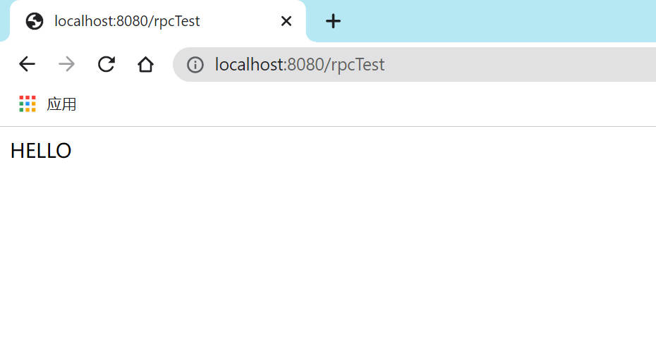

# RPC-framework

#### 介绍

一个简易的，轻量级的，Java远程调用框架。

#### 软件架构
软件架构说明


#### 安装教程

1. rpc服务器端引入以下maven坐标
    ```xml
       <dependencies>
            <dependency>
                <groupId>org.noexcs</groupId>
                <artifactId>rpc-provider-server</artifactId>
                <version>1.0</version>
            </dependency>
        </dependencies>
    ```
   添加服务端配置文件：`rpc-provider-config.yaml`
    ```yaml
    # 本地服务地址端口
    server:
      host: "localhost"
      port: 8007
    
   # 注册中心地址，如果开启的话就会向注册中心注册服务
    registry:
      enabled: false
      server: 127.0.0.1
      port: 8848
      # 提供服务名称
      serviceName: rpc-public
    ```
2. rpc客户端引入以下maven坐标
   ```xml
       <dependencies>
            <dependency>
                <groupId>org.noexcs</groupId>
                <artifactId>rpc-consumer-client</artifactId>
                <version>1.0</version>
            </dependency>
        </dependencies>
   ```
   添加客户端配置文件：`rpc-consumer-config.yml`
    ```yaml
    # 直接连接服务端，服务端地址
    provider:
      server: 127.0.0.1
      port: 8007
   
   # 注册中心地址，如果开启的话就会向注册中心发现服务
    registry:
      enabled: false
      type: nacos # 注册中心类型 暂时只支持 nacos
      serviceName: rpc-public  # 服务名称
      server: 127.0.0.1
      port: 8848
      # 负载均衡策略  需继承org.noexcs.loadBalance.AbstractLoadBalance
      loadBalancer: org.noexcs.loadBalance.impl.RandomBalance

    ```

#### 使用说明

1. 服务端

   以类的方式定义rpc服务，并使用`@Service`注解标注为Rpc服务:
    ```java
   import org.springframework.stereotype.Service;
   
    @Service
    public class StringUppercaseService {
   
        String upperCaseString(String s){
            return s.toUpperCase();
        }
   
    }
    ```
   启动服务：
   ```java
   public class ServerMain {
       public static void main(String[] args) {
            RpcServer.startBackground(ServerMain.class, true);
            new CountDownLatch(1).await();
       }
   }
   ```
2. 客户端

   以服务端定义的服务编写对应的接口：
    ```java
    public interface StringUppercaseService {
    
        String upperCaseString(String s);
   
    }
    ```
   > 接口的全限定名需要与服务端保持一致，所调用的方法也要与服务端保持一致（包括方法名，形参列表）
   > 

   调用服务：
   ```java
   public class ConsumerMain {
       public static void main(String[] args) {
           StringUpperCaseService upperCaseService = new RpcClientProxy().getProxy(StringUpperCaseService.class);
           String s = upperCaseService.upperCaseString("Hello World!");
           System.out.println(s);
       }
   }
   ```

#### 客户端与Spring Boot集成
   1. pom文件引入starter依赖：
   ```xml
       <dependencies>
           <dependency>
               <groupId>org.noexcs</groupId>
               <artifactId>rpc-noexcs-spring-boot-starter</artifactId>
               <version>1.0</version>
           </dependency>
           <!-- Spring 相关依赖 -->
       </dependencies>
   ```

   2. 配置rpc相关配置：
   ```yaml
   spring:
     noexcs:
       rpc:
         provider:
           server: 127.0.0.1
           port: 8007
         retries: 1
         timed-out: 2
   ```

   3.创建Rpc服务,这个服务的所处包的位置应该在Spring Boot的主启动类所处的包之下：
   ```java
   package org.noexcs.service;
   
   import org.noexcs.spring.boot.autoconfigure.RpcService;
   
   @RpcService
   public interface StringUpperCaseService {
   
       String upperCaseString(String s);
   }   
   ```

   4. Controller层调用：
   ```java
   package org.noexcs.controller;
   
   import org.noexcs.service.StringUpperCaseService;
   import org.springframework.beans.factory.annotation.Autowired;
   import org.springframework.web.bind.annotation.GetMapping;
   import org.springframework.web.bind.annotation.RestController;

   @RestController
   public class Controller {
       
       StringUpperCaseService stringUpperCaseService;
   
       @GetMapping("/rpcTest")
       public String testService(){
           return stringUpperCaseService.upperCaseString("hello");
       }
   
       @Autowired
       public void setStringUpperCaseService(StringUpperCaseService stringUpperCaseService) {
           this.stringUpperCaseService = stringUpperCaseService;
       }
   }   
   ```

   5. 启动服务端及Spring Boot客户端并测试，结果如下

   

#### 参与贡献

1.  Fork 本仓库
2.  新建 Feat_xxx 分支
3.  提交代码
4.  新建 Pull Request
